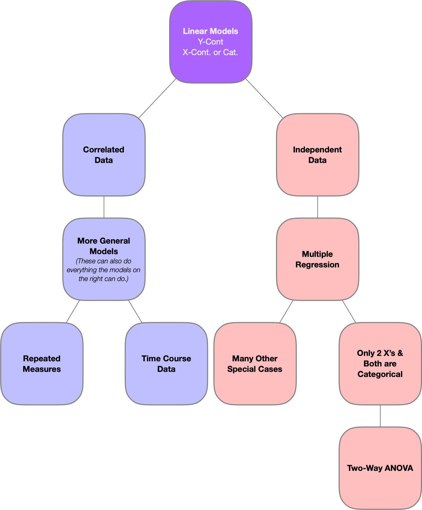

```{r setup, include=FALSE}
knitr::opts_chunk$set(echo = TRUE)
```

# Modeling a Continuous Response

```{r echo=FALSE}

```

## Multiple Linear Regression

### Main Goal {.unnumbered}

The main goal of multiple linear regression (MLR) is to develop a statistical model in order to predict an outcome. In doing so, we want to know and describe the relationship between the outcome and an explanatory variable while possibly adjusting for other variables.

### Assumptions / Structure of the Data {.unnumbered}

The explanatory variables in MLR can be either continuous or categorical.

#### Key Assumptions (if applicable) {.unnumbered}

-   **Normality**: Residuals of the linear model are assumed to be normally distributed
-   **Equal Variance**: The variance of the residuals is constant for every combination of independent variables and thus constant across all of the predicted values (residual plots)
-   **Independence**: Observations are identically and independently distributed (i.i.d.)

### Special Descriptive Statistics and/or Graphics {.unnumbered}

-   **Continuous Variables**

    -   5 number summary
    -   Histograms
    -   Box plots
    -   Scatter plots

-   **Categorical Variables**

    -   Count tables/percents
    -   Also look at summary statistics of dependent variable by levels of the categorical variable
    -   Bar charts, Pie graphs, etc.

-   **Scatter Plot Matrix/ Proc Corr**

    -   Examine relationships between the dependent and the independent variables.
    -   Also examine for possibility of multicollinearity.

-   **ASE Type Plots**

#### Diagnostic Statistics & Plots {.unnumbered}

```{r echo=FALSE}
knitr::include_graphics("https://support.sas.com/rnd/app/ODSGraphics/examples/png/DiagnosticsPanel.png")
```

-   **Raw Residuals**

    -   $Observed – Predicted$

-   **Standardized Residuals**

    -   Z-score
    -   Look for values more extreme than ± 2 or 3

-   **Studentized Residuals**

    -   t-score that takes into leverage into account
    -   Look for values more extreme than ± 2 or 3

-   **Cook's D**

    -   Uses raw residuals and leverage to see how coefficient estimates are affected without the current observation.
    -   Look for values greater than 1.

-   **Leverage**

    -   How far away an observation is relative to the center of all of the explanatory variables.

#### Multicollinearity {.unnumbered}

-   **Variance Inflation Factor (VIF)**

    -   Look out for values above 10

-   **Scatter Plot Matrices and Correlation Values**

    -   Heatmaps are good options

### Hypothesis Testing {.unnumbered}

-   **High Level F-test**: Overall significance of model:

    -   $H_0: All~β's = 0$
    -   $H_A: At~least~one~β ≠ 0$
    -   F-Test

-   **Lower Level t-Test**

    -   If overall test is significant, we want to know which ones are not 0.
    -   $H_0: intercept~or~coefficient~being~tested = 0$
    -   $H_A: intercept~or~coefficient~being~tested ≠ 0$
    -   (known as partial F-tests, but we typically use the T-test equivalent)

Testing is only valid when assumptions are met.

### What are the pros and cons of this tool in regards to it ultimately achieving its main objective? {.unnumbered}

#### Cons {.unnumbered}

-   MLR (without any interaction terms) assumes a strict linear (additive) relationship between the response and explanatory variables. If the true relationships are more complicated, it is up to the modeler to add the complexity into the model through transformations, polynomials, interactions, etc.
-   All the assumptions listed in 2 are required for the hypothesis tests to be valid. Fixing these issues can lead to less than optimal interpretations outside of log transformations.
-   Can suffer from overfitting if too complex a model is proposed, or underfitting if not complex enough. Feature selection is helpful to assess this.

#### Pros {.unnumbered}

-   Multicollinearity is not an issue for prediction
-   Method will outperform other methods when assumptions are true and trend is appropriately modeled.
-   Go-to method if interpretation is a key component of the research question.

### General Analysis Flow (For Completionists) {.unnumbered}

#### Identify the question of interest (See \#1) {.unnumbered}

#### Exploratory analysis (EDA) {.unnumbered}

-   Descriptive statistics and scatter plots
-   Assess potential outliers that may be errors in recording
-   Remove any redundant variables that will create problems with multicollinearity
-   Assess linearity of variables and conduct appropriate transformations
-   Finalize the full model in which to conduct analysis (this can be done manually or for many variables a model selection technique could help to whittle things down)

#### Analysis {.unnumbered}

-   Fit full model and assess model assumptions through residual diagnostics. Fix if necessary.
-   Conduct overall F-test for significance.
-   If significant, perform individual t-test for regression coefficients or other testing of interest to answer the question
-   Any insignificant factors can be removed and the analysis can be rerun. Likewise for observations that are outliers and it makes sense to remove them.
-   If prediction is the key goal and data is large enough. Assess how well the data set performs on an independent data set.

#### Reporting {.unnumbered}

-   Provide the final regression model equation.
-   Provide appropriate interpretation to regression coefficients that are significant and those you wish to discuss to answer the researchers questions.
-   For prediction, provide predicted values as well as 95% prediction intervals.

#### Optional {.unnumbered}

Conduct secondary analysis comparing different model selection techniques to see if the story changes much. In large number variables it likely will, but is important none the less to see that other predictors can do just as good of a job as the ones you picked.

## Feature selection tools

### Main Goal {.unnumbered}

These tools are typically implemented in predictive models to help determine a candidate model with good bias/variance trade off. Most of the tools listed can be applied in logistic regression setting as well as multiple linear. Some tools will be mentioned later.

### Summary of Feature Selection Procedures {.unnumbered}

#### Forward {.unnumbered}

Adds the covariates to the model one at a time in the order presented in the model statement. If the variable is statistically significant at the specified alpha then the covariate stays in the model and the next covariate is entered. Once a variable is "included" it cannot be dropped.

#### Backward {.unnumbered}

Backward selection involves starting with all of the covariates, deleting the least statistically significant covariate and repeating the process until no additional statistically insignificant covariates remain.

#### Stepwise {.unnumbered}

Stepwise selection involves a combination of forward and backward selection, testing at each step whether the covariate should be included or not.

#### LASSO {.unnumbered}

Uses a penalized least squares approach that squeezes the regression coefficients to 0 when the penalty is large. The algorithm starts with a large penalty and gradually relaxes the penalty to allow for a single variable to be added into the model (the coefficient is no longer 0). At each step, a model selection criterion such as AIC, SBC, AIC, etc. can be used to obtain an optimal model. Additionally, the user can specify cross-validation techniques to obtain an optimal model as well.

#### LARS {.unnumbered}

Similar to the approach of LASSO but formulated slightly differently. LARS can produce the LASSO solutions in a more efficient way.

#### Elastic Net {.unnumbered}

Procedure identical to LASSO, however the penalty is different. Elastic net uses a combination of both the LASSO penalty as well as the RIDGE regression penalty.

#### Variable Importance Ranking and "mtry" {.unnumbered}

Metric derived from bagging and random forest models (see topics later). Often used to provide a reduced set of features into other models outside of its original intended use.

### SAS (proc glm select) {.unnumbered}

-   It has a data set (training), test set, and validation set (latter 2 are optional)
-   The data set with no test or validation set specified then the one data set is for model selection and nothing more. Only internal cross validation can be done to help build the model.
-   The test set is the "validation" set in the text book. It is the completely independent data set that we can take a look at from an external validation point of view
-   The validation set is sort of a hybrid in SAS. Depending on the options you pick, the set can be used as part of the model selection procedure (part of the training set), or it could be used essentially as a second independent data set just like the test set.

``` {eval="FALSE"}
ods graphics on;
proc glmselect data=Wildflower
               seed=1 plots(stepAxis=number)=(criterionPanel ASEPlot);  # External
class Region;
model Score = Region Total Sep Oct Nov Dec Jan Feb Mar Year / 
                   selection=LASSO(choose=CV  stop=AIC) CVdetails;  # Internal
run;
quit;
ods graphics off;

ods graphics on;
proc glmselect data=train testdata=test
               seed=1 plots(stepAxis=number)=(criterionPanel ASEPlot);
class Region;
model Score = Region Total Sep Oct Nov Dec Jan Feb Mar Year / 
                   selection=LASSO(choose=CV stop=AIC) CVdetails;
run;
quit;
ods graphics off;
```

## Two-Way ANOVA

### Main Goal {.unnumbered}

The main goal of two-way analysis of variance (ANOVA) is to examine the influence of two categorical variables on one continuous dependent variable and whether any interaction exists between any of the three variables.

### Assumptions / Structure of the Data {.unnumbered}

-   Residuals have to be normal
-   Residuals have to have constant variance
-   Have to have independent data

**Additive Models**

-   No interaction terms
-   The effects of one factor are the same at all levels of the other factor. "Change in treatment does not depend on what factor 1 is." (Unit 4 lecture)

**Non-Additive Models**

-   "Changes in the treatment depend on what factor 1 is." (Unit 4 lecture)
-   Non-additive if it has interaction terms

**Saturated Models**

-   If there are as many coefficients in the model as there are cells in the table, the model is *saturated.*
-   Cell means are completely unrelated
-   Estimate of $σ^2$ is the pooled estimate of variance from all cells.
-   Pooled d.f = $n-I*J$

### Special Descriptive Statistics, performance metrics, and/or Graphics {.unnumbered}

- Mean profile plot

### Hypothesis Testing {.unnumbered}

-   $H_0$: Two categorical effects have no impact on the quantitative response variable
-   $H_A$: Two categorical effects have an impact on the quantitative response variable

### What are the pros and cons of this tool in regards to it ultimately achieving its main objective? {.unnumbered}

#### Pros {.unnumbered}

#### Cons {.unnumbered}

-   Two-Way ANOVA is limited to the specific scenario of two categorical variables and a single quantitative response variable.

### General Analysis Flow (For Completionists. Good idea for yourself, not required for Final) {.unnumbered}

-   What situation are we in?
    -   One Factor of interest with a Block
        -   Randomized Complete Block Design
    -   Two Factors
        -   Both Factors are of interest
-   Plot data (visualize through mean profile plotting)
-   Fit full saturated model with both factors and the interaction (non-additive) term
-   Diagnostics
    -   Residuals
    -   Normality, Independence, Constant Variance
    -   Outliers (Don't concern with leverage as these apply more to continuous explanatory variables)
-   Testing
    -   High level (ANOVA)
    -   Contrasts
        -   If non-additive (interaction) is significant then we reports differences of groups by factor levels
        -   If not significant, we compare contrasts of the individual factor levels (very simple -\> very complex)
        -   Both situations call for multiple testing corrections

## Time Series

### Main Goal {.unnumbered}

Time series analysis is useful for seeing changes to a measurement over time. Forecasting can be applied to model predicted future values of the data.

### Assumptions / Structure of the Data {.unnumbered}

-   Data is equally spaced in time
-   Errors are independent
-   Errors have the same variance
-   Errors are normally distributed

### Special Descriptive Statistics, performance metrics, and/or Graphics {.unnumbered}

```{r echo=FALSE}
knitr::include_graphics(here::here("6372", "cheat sheet", "images", "ARMAsim-1.png"))
```

-   Autocorrelation functions (ACF) and partial autocorrelation functions (PACF) are ways of evaluating whether stationarity is met and which model you want to use (AR, MA, ARIMA)
-   In order to be able to apply any of those models, we need to have:
    -   Constant mean
    -   Constant variance
    -   Constant autocorrelations

### Hypothesis Testing {.unnumbered}

- Durbin-Watson test
- Testing for regression coefficients

### What are the pros and cons of this tool in regards to it ultimately achieving its main objective? {.unnumbered}

#### Pros {.unnumbered}

-   Reliability
-   Seasonal patterns
-   Trend estimations
-   Growth
-   Prediction

#### Cons {.unnumbered}

-   Interpretation
-   Understanding

### General Analysis Flow (For Completionists. Good idea for yourself, not required for Final) {.unnumbered}

-   Plot the series and explanatory variables
-   Make a call on if it is stationarity or not. If not, try to get it there by either or all:
    -   Differencing the data
    -   Obtain seasonally adjusted data
    -   Model other deterministic behavior through explanatory variables via OLS
-   Examine the residuals from this model to see if any autocorrelation still exists
    -   If so, use rule of thumbs or AIC selection procedure to pic an appropriate ARIMA model
-   After accounting for the serial correlation, re-examine residuals to make sure they are behaving uncorrelated and are normally distributed
-   Repeat steps above as necessary
-   Proceed to tests and forecasting

## Repeated Measures

### Main Goal {.unnumbered}

The goal of repeated measures is to measure the same variable on each subject several times, possibly under different conditions.

### Assumptions / Structure of the Data {.unnumbered}

-   Each predictor does not need to be normally distributed in a regression model
-   Normality can be difficult to assess in smaller sample sizes
-   t-Test is valid in larger data sets due to CLT and is valid regardless of whether residuals are normal or not (normality only)
-   Correlation between response components is the same in both groups

### Special Descriptive Statistics, performance metrics, and/or Graphics {.unnumbered}

-   Profile plots (scatter plots) for each subject showing the response versus time or condition.
-   If a summary value can be found that addresses the question being studied, a univariate analysis can be performed on that specific value. Examples include:
    -   Profile average
    -   Final response
    -   Minimum
    -   Maximum
    -   Treatment difference
    -   Time where maximum occurs (or another condition is attained)
    -   Estimated slope in a regression of the response on time
-   Pooled estimates of variance and covariance
-   Confidence ellipses
-   Individual confidence intervals in bivariate means
-   Repeated measures ANOVA

### Hypothesis Testing {.unnumbered}

-   $H_0: X_1 = X_2 = X_3 = ... X_i$
-   $H_0: X_1 ≠ X_2 ≠ X_3 ≠ ... X_i$

### What are the pros and cons of this tool in regards to it ultimately achieving its main objective? {.unnumbered}

#### Pros {.unnumbered}

-   Low variability

#### Cons {.unnumbered}

-   Challenges in finding subjects who can be subjected to all aspects of the research

### General Analysis Flow (For Completionists. Good idea for yourself, not required for Final)

-   Plot data through profile plots when dealing with factors or subjects, summary stats, and identifying key variables to include in the model
-   Fit full model including an extra term that deals with the repeated measures (Repeated statement)
-   Examine the residual diagnostics:
    -   Plot residuals for constant variance and normality
    -   Proc GLM test for sphericity/ compound symmetry
    -   Proc mixed fit different correlation structures use AIC/BIC model selection
-   Once an appropriate model is determined:
    -   Conduct the appropriate analysis tests given the particular modeling strategy, this could be MLR, One-Way / Two-Way ANOVA, etc.
        -   High level testing (ANOVA F tests for designs involving categorical factors, like two way anova) / test for regression coefficients for continuous
        -   Test using contrasts for more specific questions of interest / or investigating significant categorical factors

# Modeling a Categorical Response

## Logistic Regression

### Main Goal {.unnumbered}

The goal of logistic regression is to estimate the probability that a qualitative variable belongs to a particular category.

### Assumptions / Structure of the Data {.unnumbered}

The explanatory variables in logistic regression can be either continuous or categorical, but the response variable is categorical.

### Special Descriptive Statistics, performance metrics, and/or Graphics {.unnumbered}

- Scatter plots
- Box plots
- Histograms
- Confusion matrices

### Hypothesis Testing {.unnumbered}

- Deviance & Pearson Goodness of Fit Tests
- LASSO
- Hosmer-Lemeshow Test
- ROC curves & AUC

### What are the pros and cons of this tool in regards to it ultimately achieving its main objective? {.unnumbered}

#### Pros {.unnumbered}

- If the model is additive, it can be easy to interpret the model

#### Cons {.unnumbered}

- Interpretation can be difficult if too many interaction terms are added

### General Analysis Flow (For Completionists. Good idea for yourself, not required for Final) {.unnumbered}

- Model Fitting
  - Feature selection
  - Common sense / manual iteration
  - Interactions / transformations
- Assess goodness of fit and/or lack of fit
  - Only categorical predictors
    - Deviance and Pearson Goodness of Fit tests
    - Comparing model to a more complex one (Forward selection)
    - LASSO
    - Hosmer-Lemeshow test
  - One or more continuous predictors
    - Comparing model to a more complex one (Forward selection)
    - LASSO
    - Hosmer-Lemeshow test
  - Cross-validation
  - Residual diagnostics
- Provide estimates of coefficients
- Provide prediction performance through ROC curves and confusion matrices

## Linear and Quadratic Discriminant Analysis

### Main Goal {.unnumbered}

-   Given a new observation, can I predict the response?
-   Understanding of which variables contribute to the differences in response

### Assumptions / Structure of the Data {.unnumbered}

-   Same assumptions as MANOVA
-   Equal covariance for LDA, otherwise QDA
-   Normally distributed variables

### Special Descriptive Statistics, performance metrics, and/or Graphics {.unnumbered}

-   Scatter plots are incredibly helpful for visualizing the data and the distributions
-   Classification summaries

### Hypothesis Testing {.unnumbered}

### What are the pros and cons of this tool in regards to it ultimately achieving its main objective? {.unnumbered}

#### Pros {.unnumbered}

-   More statistical power
-   Fewer subjects
-   Quicker and cheaper
-   Assess an effect over time

#### Cons {.unnumbered}

-   Order effects
-   Curse of dimensionality (lots of trash variables)

### General Analysis Flow (For Completionists. Good idea for yourself, not required for Final) {.unnumbered}

-   Do due diligence in assessing normality, equal covariance matrices, and outliers
-   If equal covariance isn't met, move to QDA
-   If several variables are non-normal, consider an alternative like logistic regression
-   Unless the sample size is big enough to have training and testing sets, use cross-validation to avoid biasing error rates too much

# Unsupervised Tools

## Principle Component Analysis

### Main Goal {.unnumbered}

The main goal of PCA is to create new, uncorrelated variables from a group of variables that can be used to understand the relationship among the original variables and for other analyses such as MLR and classification.

### Assumptions / Structure of the Data {.unnumbered}

-   Variables are normally distributed
-   Continuous variables

### Special Descriptive Statistics and/or Graphics {.unnumbered}

-   **Principal Components** - new variables created by PCA (PC1, PC2, etc.)
-   **Eigenvalues** - variances of PC's
-   **Eigenvectors** - coefficients applied to original variables to create PC's
-   **Covariance Matrix** - variance of each variable and covariance between all variables
-   **Correlation Matrix** - covariance matrix where all values range between -1 and 1

### How can PCA be used inside of a predictive model setting? {.unnumbered}

1.  Conduct PCA on the continuous variables
2.  Plot the first few PC's (check scree plot for number) and color-code by response variable
3.  If colors are generally separate, the future predictive model typically will as well
4.  PC's can be used as predictors in future model as well

### What are the pro's and con's of this tool in regards to it ultimately achieving its main objective? {.unnumbered}

#### Pros {.unnumbered}

-   No multicollinierity
-   Can reduce variables to a manageable set
-   Insight into underlying structures
-   Sanity check before classification

#### Cons {.unnumbered}

-   Interpretation of PCs can be difficult to explain
-   No guarantee that PCs will correlate better than original variables
-   Large sample size needed

## Clustering and Heatmap Visuals

### Main Goal {.unnumbered}

The goal of cluster analysis is to group similar objects in such a way that intra-cluster distances are minimized and inter-cluster distances are maximized.

### Assumptions / Structure of the Data {.unnumbered}

Depending on the structure of the data, clustering could either be hierarchical or non-hierarchical. Hierarchical clustering involves progressively nesting clusters until only a single cluster remains. Non-hierarchical clustering involves separating observations into non-overlapping clusters.

### Special Descriptive Statistics and/or Graphics {.unnumbered}

**External**

-   Known Class or Groups
-   Chi-Square Tests

**Internal**

-   Root Mean Square Standard Deviation (RMSSTD)
    -   Pooled standard deviation of all of the variables forming the cluster
    -   Smaller is better
    -   [SAS help](https://support.sas.com/documentation/cdl/en/statug/63962/HTML/default/viewer.htm#statug_cluster_sect009.htm)
-   Semi-Partial R-Squared (SPRSQ)
    -   Measure of homogeneity of merged clusters
    -   Higher is better
    -   [SAS help](https://support.sas.com/documentation/cdl/en/statug/63347/HTML/default/viewer.htm#statug_cluster_sect021.htm)
-   Cubic Clustering Criterion
    -   "The cubic clustering criterion (CCC) can be used to estimate the number of clusters using Ward's minimum variance method, k -means, or other methods based on minimizing the within-cluster sum of squares. The performance of the CCC is evaluated by Monte Carlo methods." [source](https://documentation.sas.com/?docsetId=emref&docsetTarget=n1dm4owbc3ka5jn11yjkod7ov1va.htm&docsetVersion=14.3&locale=en)
-   Pseudo t2
-   Silhouette Statistic
-   Dunn's Index

### Hypothesis Testing {.unnumbered}

- Scatter plots
- Dendrograms
- Heatmaps

### What are the pros and cons of this tool in regards to it ultimately achieving its main objective? {.unnumbered}

#### Pros {.unnumbered}

-   Checking for outliers & unique patterns
-   Can help find patterns in groups
-   Can help find highly correlated variables

#### Cons {.unnumbered}

-   No known classification to help (completely unsupervised)
-   Variables on different scales may skew clusters

### General Analysis Flow (For Completionists. Good idea for yourself, not required for Final) {.unnumbered}

-   Select a distance measure
-   Select a clustering algorithm
-   Define the distance between clusters
-   Define the number of clusters
-   Validate the analysis

### Visual Interpretation {.unnumbered}

Graphics by [Allison Horst](https://github.com/allisonhorst).

#### K-Means Clustering

```{r echo=FALSE}
knitr::include_graphics(here::here("6372", "cheat sheet", "images", "kmeans_1.jpg"))
knitr::include_graphics(here::here("6372", "cheat sheet", "images", "kmeans_2.jpg"))
knitr::include_graphics(here::here("6372", "cheat sheet", "images", "kmeans_3.jpg"))
knitr::include_graphics(here::here("6372", "cheat sheet", "images", "kmeans_4.jpg"))
knitr::include_graphics(here::here("6372", "cheat sheet", "images", "kmeans_5.jpg"))
knitr::include_graphics(here::here("6372", "cheat sheet", "images", "kmeans_6.jpg"))
knitr::include_graphics(here::here("6372", "cheat sheet", "images", "kmeans_7.jpg"))
knitr::include_graphics(here::here("6372", "cheat sheet", "images", "kmeans_8.jpg"))
knitr::include_graphics(here::here("6372", "cheat sheet", "images", "kmeans_9.jpg"))
knitr::include_graphics(here::here("6372", "cheat sheet", "images", "kmeans_10.jpg"))
knitr::include_graphics(here::here("6372", "cheat sheet", "images", "kmeans_11.jpg"))
knitr::include_graphics(here::here("6372", "cheat sheet", "images", "kmeans_12.jpg"))
```

#### Hierarchical Clustering

```{r echo=FALSE}
knitr::include_graphics(here::here("6372", "cheat sheet", "images", "cluster_single_linkage_1.jpg"))
knitr::include_graphics(here::here("6372", "cheat sheet", "images", "cluster_single_linkage_2.jpg"))
knitr::include_graphics(here::here("6372", "cheat sheet", "images", "cluster_single_linkage_3.jpg"))
knitr::include_graphics(here::here("6372", "cheat sheet", "images", "cluster_single_linkage_4.jpg"))
knitr::include_graphics(here::here("6372", "cheat sheet", "images", "cluster_single_linkage_5.jpg"))
knitr::include_graphics(here::here("6372", "cheat sheet", "images", "cluster_single_linkage_6.jpg"))
knitr::include_graphics(here::here("6372", "cheat sheet", "images", "cluster_single_linkage_7.jpg"))
```

